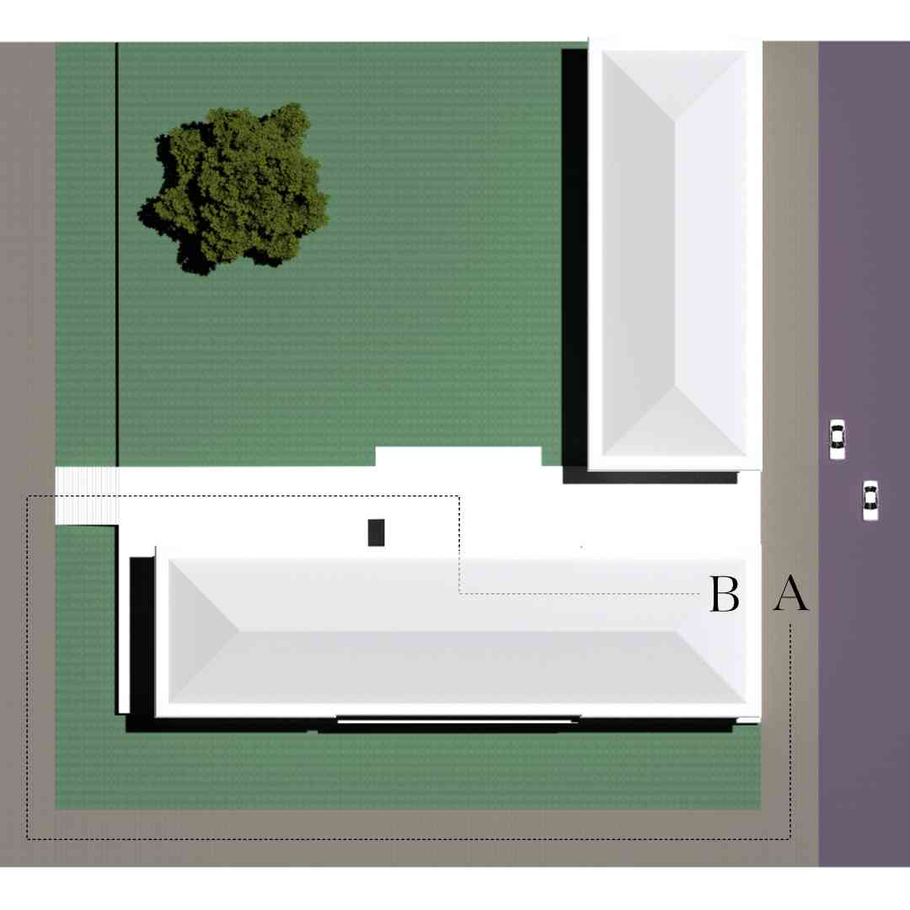
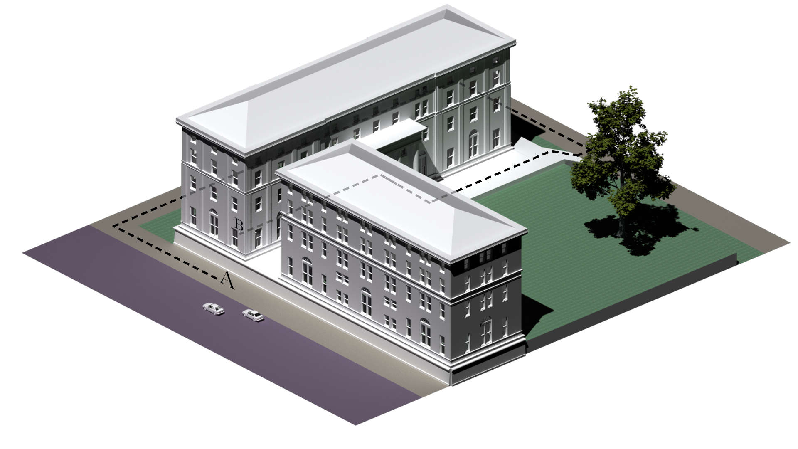
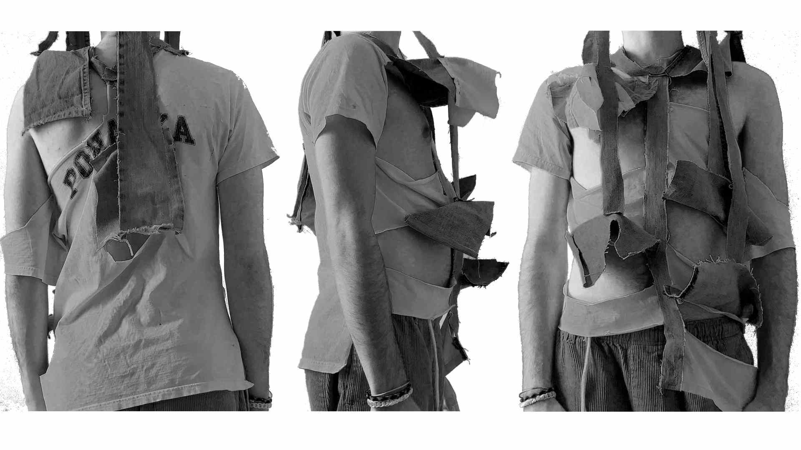
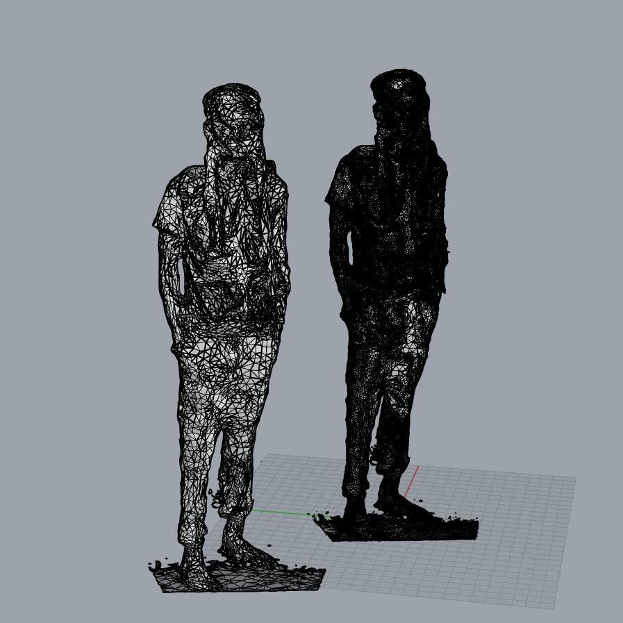
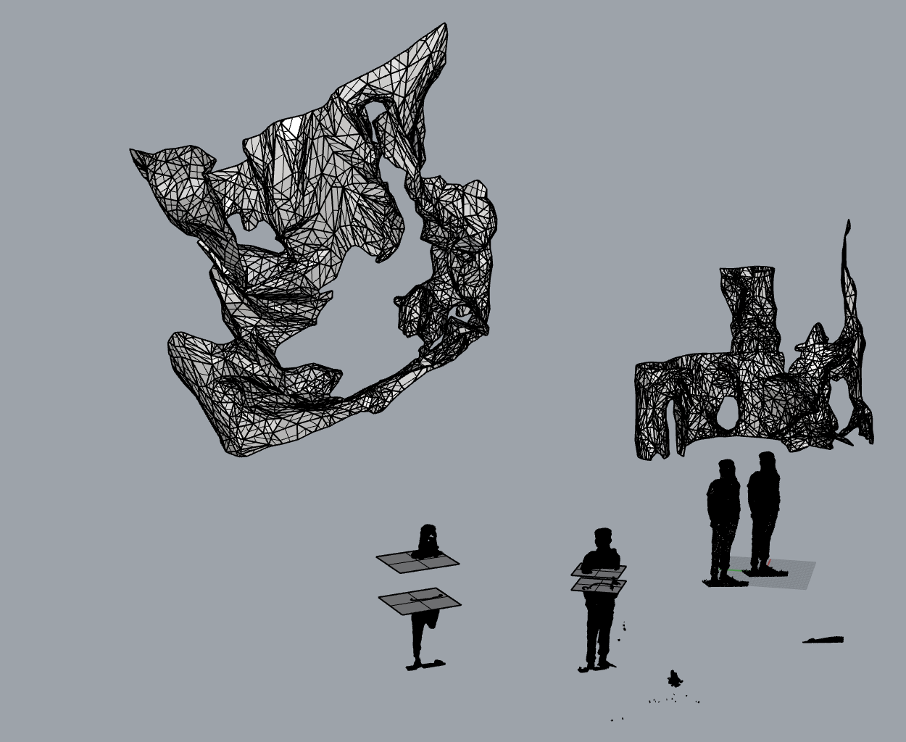
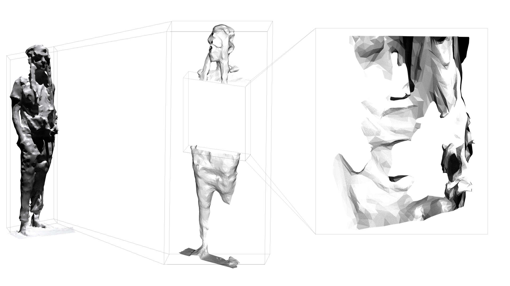
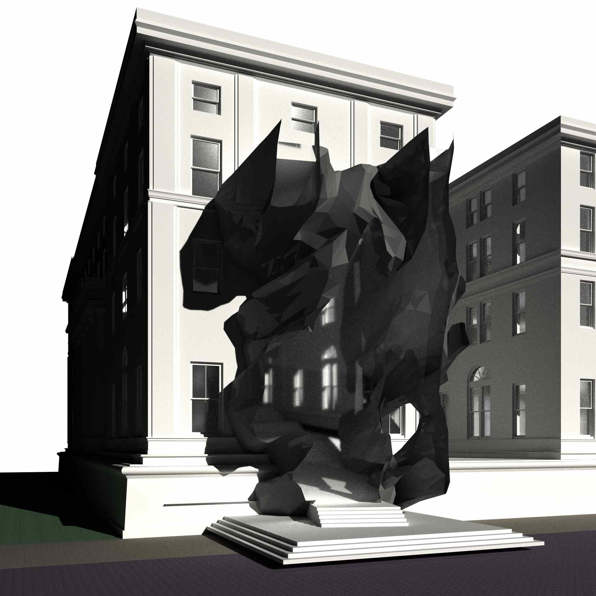
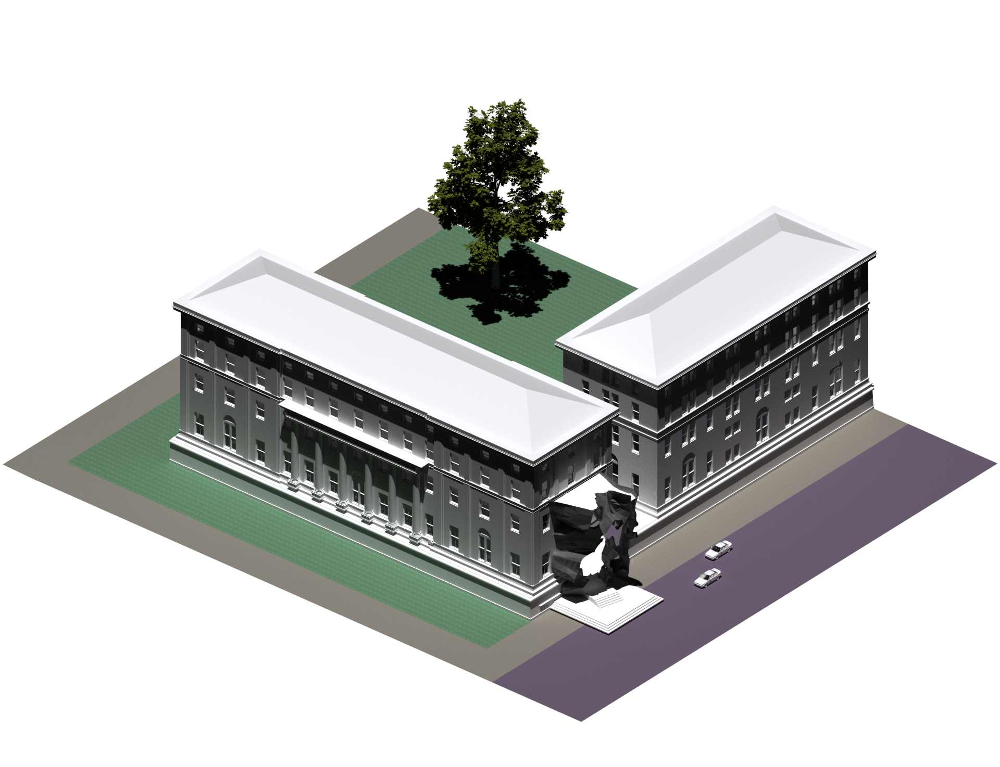
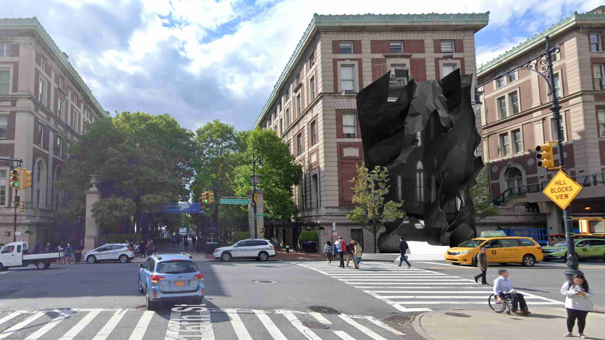

import {FlexContainer, HalfWidth, ThirdWidth, TwoThirdsWidth } from '../../../components/post'
import Floors from './floors.svg'
import Elevation from './Elevation.svg'

#### Introduction

<FlexContainer>
    <ThirdWidth>
        Photogrammetry is a computational process whereby photos of an object taken from different angles can be used to reconstruct a 3D model of the object.

        While a typical architectural design process might involve creating 2D sketches and creating 3D models off of them, I wondered: How could photogrammetry be used as a tool for digitally sketching in 3D?
    </ThirdWidth>
    <ThirdWidth>
        `video: ./photogrammetry-diagram-720-min.mp4`
    </ThirdWidth>
</FlexContainer>

#### Design Problem

<FlexContainer>
    <ThirdWidth>
        Kent Hall is a building on Columbia’s campus, directly adjacent to Amsterdam Avenue. However, to access the building from Amsterdam Ave, you would have to walk past the building, through the Columbia gates, and completely around the building to arrive at the front door.

        My goal was to build a sculptural entryway and addition to the East Asian Library in Kent Hall, enabling access directly from Amsterdam Ave.
    </ThirdWidth>
    <ThirdWidth>
        

    </ThirdWidth>
</FlexContainer>
<TwoThirdsWidth>
    
</TwoThirdsWidth>

#### Process

<FlexContainer>
    <ThirdWidth>
        I envisioned this entryway as a rip in the fabric of Columbia’s deliberately exclusionary architecture, so I fabricated a severely distressed article of clothing using cotton and denim to use as a basis for the investigation of architectural form.
    </ThirdWidth>
    <ThirdWidth style={{height: '100px'}}>
        
    </ThirdWidth>
</FlexContainer>

<FlexContainer>
    <ThirdWidth>
        Using Photogrammetry, I was able to create a 3D digital model of myself wearing the distressed article.
    </ThirdWidth>
    <ThirdWidth>
        
    </ThirdWidth>
</FlexContainer>

<FlexContainer>
    <ThirdWidth>
        I used operations in Rhino to dissect and warp the model, ultimately settling on a form to use in my design.
    </ThirdWidth>
    <ThirdWidth>
        
    </ThirdWidth>
</FlexContainer>

<HalfWidth>
    
</HalfWidth>

<FlexContainer>
    <ThirdWidth>
        I inserted the form in my site model, and modified it some more to fit my requirements.
    </ThirdWidth>
    <ThirdWidth>
        
    </ThirdWidth>

</FlexContainer>
    <TwoThirdsWidth>
    
</TwoThirdsWidth>

<FlexContainer>
    <ThirdWidth>
        Once I was happy with the 3D model of my design, I was able to create 2D drawings.
    </ThirdWidth>
    <ThirdWidth>
        <Floors/>
    </ThirdWidth>
</FlexContainer>

<ThirdWidth>
    <Elevation/>
</ThirdWidth>

#### Conclusion

<FlexContainer>
    <ThirdWidth>
        In this project, I put myself in the shoes of an architect and explored how photogrammetry could be used as a creative tool in existing workflows.

        This experience taught me that the best way to find applications for new technologies is by taking an empathetic approach, meeting users where they are and experimenting within existing workflows and paradigms.
    </ThirdWidth>
    <HalfWidth>
        
    </HalfWidth>
</FlexContainer>

