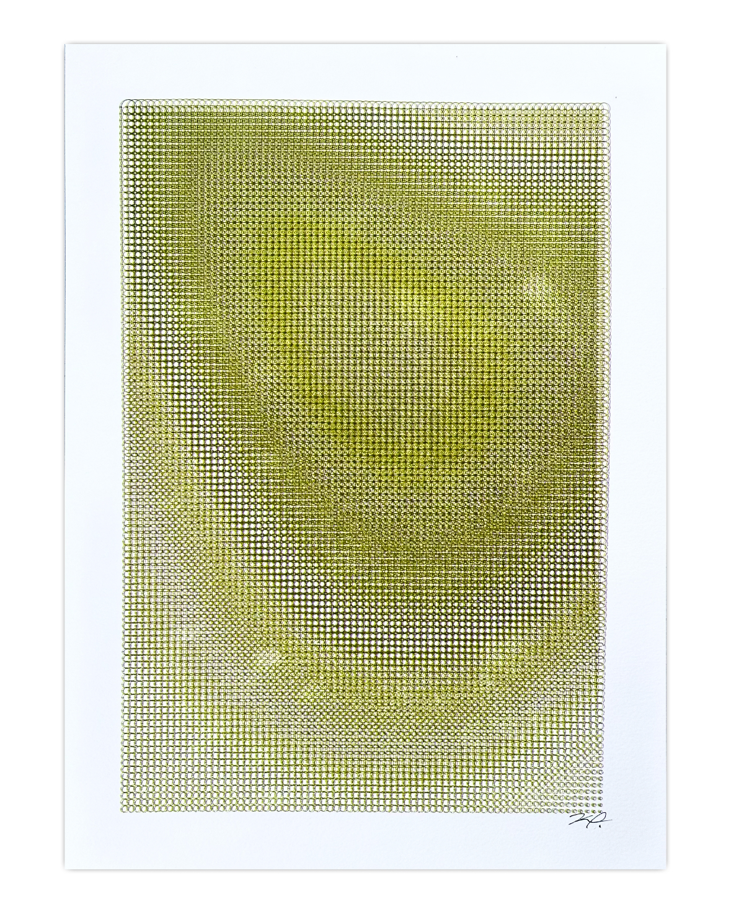

This is a paragraph of Lorem Ipsum Dolor.This is a paragraph of Lorem Ipsum Dolor. This is a paragraph of Lorem Ipsum Dolor. This is a paragraph of Lorem Ipsum Dolor. This is a paragraph of Lorem Ipsum Dolor. This is a paragraph of Lorem Ipsum Dolor. This is a paragraph of Lorem Ipsum Dolor. This is a paragraph of Lorem Ipsum Dolor.

    This is a paragraph of Lorem Ipsum Dolor.This is a paragraph of Lorem Ipsum Dolor. This is a paragraph of Lorem Ipsum Dolor. This is a paragraph of Lorem Ipsum Dolor. This is a paragraph of Lorem Ipsum Dolor. This is a paragraph of Lorem Ipsum Dolor. This is a paragraph of Lorem Ipsum Dolor. This is a paragraph of Lorem Ipsum Dolor.

This is a paragraph of Lorem Ipsum Dolor.This is a paragraph of Lorem Ipsum Dolor. This is a paragraph of Lorem Ipsum Dolor. This is a paragraph of Lorem Ipsum Dolor. This is a paragraph of Lorem Ipsum Dolor. This is a paragraph of Lorem Ipsum Dolor. This is a paragraph of Lorem Ipsum Dolor. This is a paragraph of Lorem Ipsum Dolor.

## Introduction

