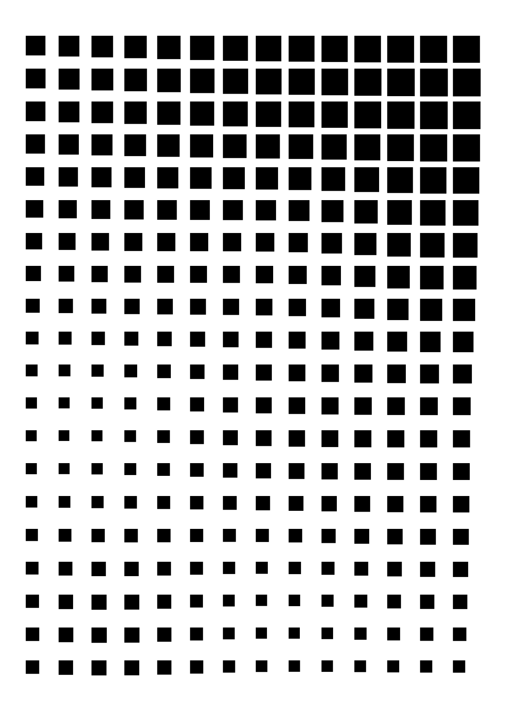
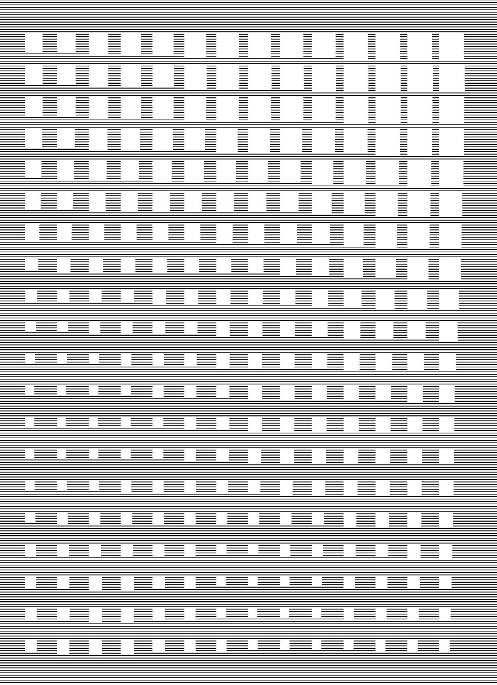
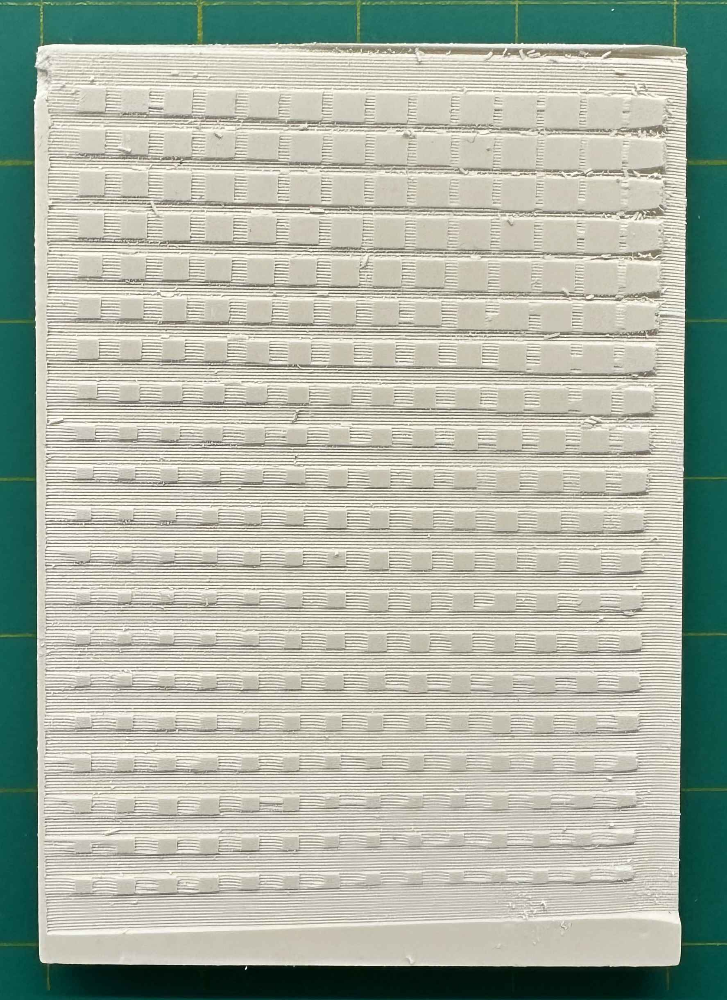
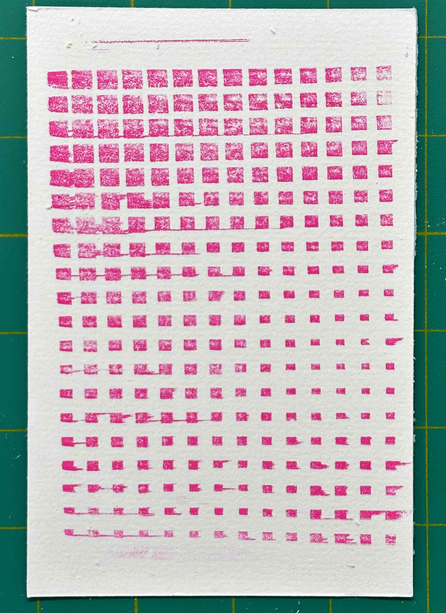

import {
    FlexContainer,
    HalfWidth,
    ThirdWidth,
    TwoThirdsWidth,
    TwentyPercentWidth,
    CustomWidth,
    Caption
} from '../../../components/post'

#### Introduction
<FlexContainer>
    <HalfWidth>
        Seeking to take my generative art further, I began using a pen plotter to create physical prints of my parametric sketches.
        I was especially interested to see how I could create gradients using small, repeated shapes.

         
    </HalfWidth>
</FlexContainer>
<FlexContainer>
    <ThirdWidth>
        `video: ./grad1.mp4`
    </ThirdWidth>
    <ThirdWidth>
        `video: ./grad2.mp4`
    </ThirdWidth>
</FlexContainer>

#### Proof of Concept
<FlexContainer>
    <ThirdWidth>
        I was curious to see if I could take it one step further and use the plotter to carve linocut stamps for block printing.

        I performed a proof-of-concept experiment and found that while the plotter could carve the lino, it could only carve straight lines in one direction.

    </ThirdWidth>
    <ThirdWidth>
        `video: ./proofofconcept.mp4`
    </ThirdWidth>
</FlexContainer>

#### Software
<FlexContainer>
    <ThirdWidth>
       Given the constraints discovered in the proof of concept experiment, I coded a utility using TypeScript and p5.js to convert input images into straight line drawings suitable for the plotter.

    </ThirdWidth>
    <ThirdWidth>
        `video: ./software2.mp4`
    </ThirdWidth>
</FlexContainer>

#### Carving
<FlexContainer>
    <ThirdWidth>
        Once the image had been converted to a line drawing, I could carve it using the pen plotter.
    </ThirdWidth>
    <ThirdWidth>
        carving
    </ThirdWidth>
</FlexContainer>

#### Printing
<FlexContainer>
    <ThirdWidth>
       Generative images could be printed using normal block printing techniques.
    </ThirdWidth>
    <ThirdWidth>
        `video: ./printing.mp4`
    </ThirdWidth>
</FlexContainer>

#### Workflow Visualized
<FlexContainer>
    <CustomWidth width={"20%"}>
        
    </CustomWidth>
    <CustomWidth width={"20%"}>
        
    </CustomWidth>
    <CustomWidth width={"20%"}>
        
    </CustomWidth>
    <CustomWidth width={"20%"}>
        
    </CustomWidth>
</FlexContainer>