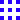
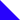

import {FlexContainer, HalfWidth, ThirdWidth, TwoThirdsWidth, CustomWidth, Caption, Key } from '../../../components/post'
import SystemDiagram from './system-diagram.svg'
import ShaderDiagram from './shader-diagram.svg'

#### Motivation
<FlexContainer>
    <ThirdWidth>
       Imagine a pen held in a fixed position with a paper moved under it. The pen can be raised and lowered independently of paper movement. This simple idea was the basis for this digital exploration.
    </ThirdWidth>
    <ThirdWidth>
        `video: ./inspo.mp4`
    </ThirdWidth>
</FlexContainer>

#### Initial Approach
<FlexContainer>
    <ThirdWidth>
        Moving a piece of paper under a pen is analogous to translating all the pixels in a digital image. Therefore, I set out to build a system where each frame is calculated based on the previous frame and a series of user inputs.
    </ThirdWidth>
    <ThirdWidth>
       <SystemDiagram/>
    </ThirdWidth>
</FlexContainer>
<br/>
<FlexContainer>
    <ThirdWidth>
        At the heart of this system is a GLSL shader. The shader generates a new frame by translating all the pixels from the previous frame based on the boolean input and drawing the kernel at the center. For example, if up is true, then the value for pixel x,y
        in the current frame would be the value for pixel x,y-1 in the previous frame.
    </ThirdWidth>
    <ThirdWidth>
        <ShaderDiagram/>
        <Caption>Translating the pixels in a 6x6 image down 1 pixel.</Caption>
    </ThirdWidth>
</FlexContainer>
<br/>

<FlexContainer>
    <ThirdWidth>
        For initial experimentation, I wired up the boolean shader inputs to the WASD keys on my keyboard, allowing me
        to move around the canvas like a game of snake.
    </ThirdWidth>
    <ThirdWidth>
        <CustomWidth width={"83%"}>
            `video: ./firstattempt.mp4`
        </CustomWidth>
    </ThirdWidth>
</FlexContainer>

#### Additional Features
<FlexContainer>
    <ThirdWidth>
        With the basic mechanism in place, I added additional features to enable creative art-making with Pixel Painter.
    </ThirdWidth>
    <ThirdWidth>
    </ThirdWidth>
</FlexContainer>

##### Kernels
<FlexContainer>
    <ThirdWidth>
       Kernel color and design can be changed.
    </ThirdWidth>
    <ThirdWidth>
        <CustomWidth width={"83%"}>
            `video: ./color.mp4`
        </CustomWidth>
        <FlexContainer>
            <CustomWidth width={"30%"}>
                
                <Caption>Square</Caption>
            </CustomWidth>
            <CustomWidth width={"30%"}>
                
                <Caption>Dots</Caption>
            </CustomWidth>
            <CustomWidth width={"30%"}>
                
                <Caption>Triangle</Caption>
            </CustomWidth>
        </FlexContainer>
    </ThirdWidth>
</FlexContainer>

##### Speed
<FlexContainer>
    <ThirdWidth>
        The speed of the animation can be changed by increasing the number of pixels we translate each frame.
    </ThirdWidth>
    <ThirdWidth/>
</FlexContainer>
<br/>
<TwoThirdsWidth>
    <FlexContainer>
        <CustomWidth width={"30%"}>
            `video: ./speed-1_min.mp4`
            <Caption>1px/frame</Caption>
        </CustomWidth>
        <CustomWidth width={"30%"}>
            `video: ./speed-5_min.mp4`
            <Caption>5px/frame</Caption>
        </CustomWidth>
        <CustomWidth width={"30%"}>
            `video: ./speed-10_min.mp4`
            <Caption>10px/frame</Caption>
        </CustomWidth>
    </FlexContainer>
</TwoThirdsWidth>
##### Pen up/down
<FlexContainer>
    <ThirdWidth>
        The pen can be raised and lowered so that we can navigate the canvas without drawing on it.
    </ThirdWidth>
    <CustomWidth width={"25%"}>
        `video: ./pentoggle.mp4`
    </CustomWidth>
</FlexContainer>
##### Color Inversion
<FlexContainer>
    <ThirdWidth>
        All colors on the canvas can be inverted while leaving the kernel unchanged.
    </ThirdWidth>
    <CustomWidth width={"25%"}>
        `video: ./invert.mp4`
    </CustomWidth>
</FlexContainer>

#### Manual Mode
<FlexContainer>
    <HalfWidth>
        <br/>
        <FlexContainer>
            <CustomWidth width={"65%"}>
                `video: ./manual_artwork_min.mp4`
            </CustomWidth>
        </FlexContainer>
        For initial experimentation, I wired up each of the features to keys on the keyboard to create a manual mode for artwork creation.

        The experience of creating an artwork in manual mode is across between playing an instrument and playing a video game.
        A combination of timing, dexterity, and technical mastery is necessary to execute an exciting artwork.

    </HalfWidth>
    <CustomWidth width={"27%"}>
        `video: ./manual.mp4`
    </CustomWidth>
</FlexContainer>
<br/>.
#### Pixel Painter Command Language (PPCL)


<FlexContainer>
    <ThirdWidth>
        I found that it could be difficult to create sophisticated artworks in manual mode, so I developed a simple
        scripting language to define pixel painter artwork.
        In PPCL, one line defines one frame of the animation.

        **Commands:**
        <table>
            <tr>
                <td>`up`</td>
                <td>Move the kernel up one pixel.</td>
            </tr>
            <tr>
                <td>`down`</td>
                <td>Move the kernel down one pixel.</td>
            </tr>
            <tr>
                <td>`left`</td>
                <td>Move the kernel left one pixel.</td>
            </tr>
            <tr>
                <td>`right`</td>
                <td>Move the kernel right one pixel.</td>
            </tr>
            <tr>
                <td>`kernelSize=10`</td>
                <td> Sets the side length of the kernel.</td>
            </tr>
            <tr>
                <td>`kernelMode=solid` </td>
                <td>Sets the kernel mode.</td>
            </tr>
            <tr>
                <td>`kernelParam=2` </td>
                <td>Sets the optional param for the kernel.</td>
            </tr>
            <tr>
                <td>`kernelColor=0,0,0`</td>
                <td> Sets the rgb values for the kernel color.</td>
            </tr>
            <tr>
                <td>`invert`</td>
                <td> Inverts all colors in the image.</td>
            </tr>
            <tr>
                <td>`togglePen`</td>
                <td> Toggles the kernel writing on the canvas.</td>
            </tr>
            <tr>
                <td>`penUp`</td>
                <td> Sets the pen to not write on the canvas.</td>
            </tr>
            <tr>
                <td>`penDown`</td>
                <td> Sets the pen to write on the canvas.</td>
            </tr>
        </table>
        **Control Structures:**

        Only two simple control structures exist in PPCL: line repetition and block repetition.

        Prepend a command line with an integer N to repeat that command N times.

        Wrap a block in parens prepended with an integer N to repeat the block N times. Note that the parens MUST have their own lines.

    </ThirdWidth>
    <ThirdWidth centerVertically={false}>
        `video: ./ppcl2.mp4`
    </ThirdWidth>
</FlexContainer>
<FlexContainer>
    <ThirdWidth>
        **Example:**
        ```
        5 (
        frameMultiplier=2
        penDown
        50 right up
        50 left up
        50 left down
        50 right down
        invert penUp
        frameMultiplier=5
        20 down
        )
        20 left
        ```
        This PPCL code draws a simple repeating diamond pattern.

        **Writing PPCL:**

        While PPCL can be written manually in a text editor, I've also implemented a mechanism to record commands from manual mode and export the PPCL. In this way, manual mode can be used as a testing/experimentation ground to generate PPCL for use in future artworks.
    </ThirdWidth>
    <ThirdWidth>
        <CustomWidth width={"83%"}>
            `video: ./ppcl_example_trimmed_min.mp4`
        </CustomWidth>
    </ThirdWidth>
</FlexContainer>


#### Infinite Artworks
<FlexContainer>
    <ThirdWidth>
        When Pixel Painter finishes executing a PPCL script, it restarts execution from the beginning of the script without clearing the canvas.
        As a result, we can use PPCL to create infinite artworks that continue to animate forever, so long as the PPCL script leaves the kernel in a different position than it started and the script will not completely cover the canvas in one color.

        Unlike the other artworks on this page (which are video files), the artwork to the right is embedded javascript and will continue generating indefinitely.
    </ThirdWidth>
    <ThirdWidth>
        <iframe src="https://sketchbook.kieran.lol/pixel_05.html" style={{width: "25vw", height: "25vw", margin: "auto"}}></iframe>
    </ThirdWidth>
</FlexContainer>


#### Using Javascript to Generate PPCL

<FlexContainer>
    <ThirdWidth>
        We can also use Javascript to generate complex PPCL. This also enables us to use tools like fxhash to generate pixel painter artworks parametrically.

        In the artwork to the right, I have used Javascript to generate a new color value for the kernel at each frame, enabling me to create gradients.
</ThirdWidth>
    <ThirdWidth>
        <CustomWidth width={"83%"}>
            `video: ./javascript_min.mp4`
        </CustomWidth>
    </ThirdWidth>
</FlexContainer>
#### Interactive Demo
<FlexContainer>
    <iframe src="https://sketchbook.kieran.lol/pixel_painter.html" style={{width: "45vw", height: "45vw", margin: "auto"}}></iframe>
    <Caption>Click above to start making your own artwork with Pixel Painter. ([open in a new window](https://sketchbook.kieran.lol/pixel_painter.html))</Caption>
</FlexContainer>
<ThirdWidth>
 **Commands:**
        <table>
    <tr>
        <td><Key>W</Key><Key>A</Key><Key>S</Key><Key>D</Key></td>
        <td>Move the canvas relative to the Kernel.</td>
    </tr>
    <tr>
        <td><Key>ESC</Key></td>
        <td>Open the control panel to input PPCL or change parameter values.</td>
    </tr>
    <tr>
        <td><Key>E</Key></td>
        <td>Increase animation speed.</td>
    </tr>
    <tr>
        <td><Key>Q</Key></td>
        <td>Decrease animation speed.</td>
    </tr>
    <tr>
        <td><Key>R</Key></td>
        <td> Invert canvas colors.</td>
    </tr>
    <tr>
        <td><Key>F</Key></td>
        <td>Raise/lower the pen.</td>
    </tr>
</table>
</ThirdWidth>