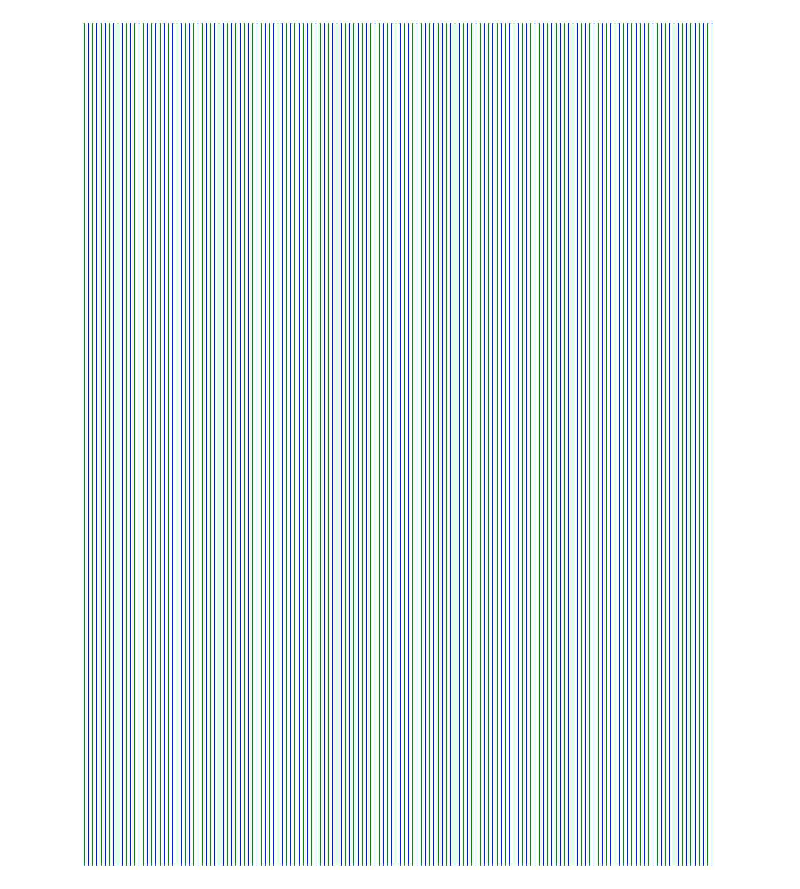
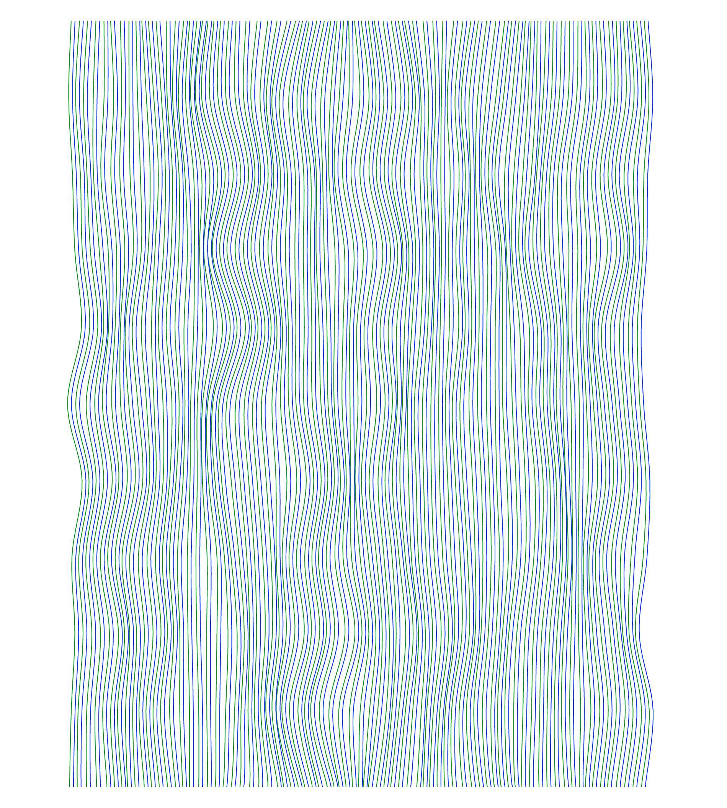
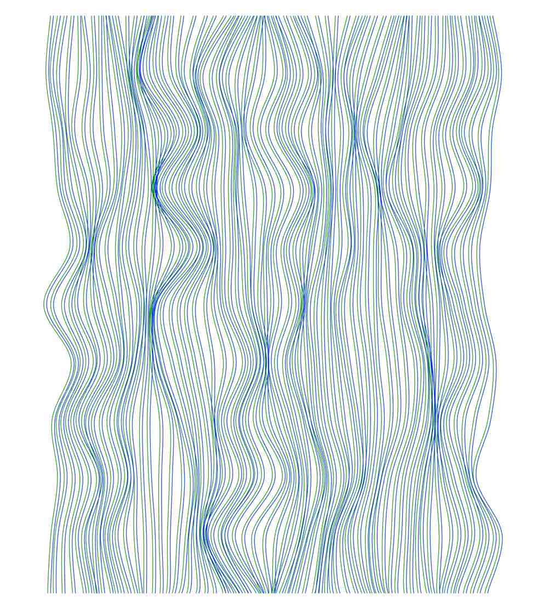
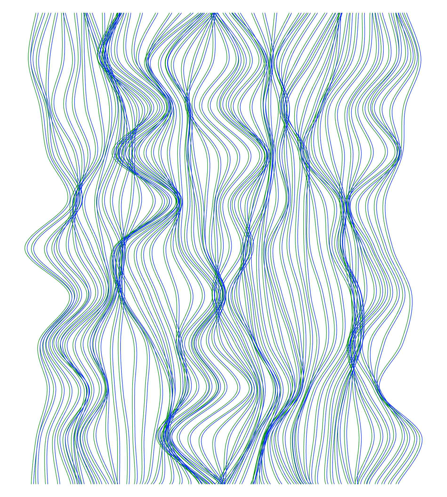
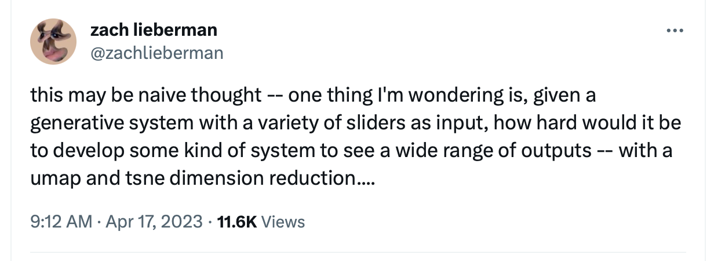

import {FlexContainer, HalfWidth, ThirdWidth, TwoThirdsWidth, TwentyPercentWidth, CustomWidth, Caption, } from '../../../components/post'

#### Motivation
<FlexContainer>
    <ThirdWidth>
        Generative art sketches are often created with code that draws according to input parameters, where changing these parameters can change the output image.
    </ThirdWidth>
    <HalfWidth>
        <FlexContainer>
            <HalfWidth>
                
                <Caption>0</Caption>
            </HalfWidth>
            <HalfWidth>
                
                <Caption>40</Caption>
            </HalfWidth>
            <HalfWidth>
                
                <Caption>100</Caption>
            </HalfWidth>
            <HalfWidth>
                
                <Caption>200</Caption>
            </HalfWidth>
        </FlexContainer>
    </HalfWidth>
</FlexContainer>
<FlexContainer>
    <ThirdWidth>
        To add a simple UI to adjust parameters, I use [quicksettings](https://github.com/bit101/quicksettings) by bit101.
        However, this requires manual work to see all the possibilities.
    </ThirdWidth>
    <HalfWidth>
        `video: ./vanilla-quicksettings.mp4`
    </HalfWidth>
</FlexContainer>
<FlexContainer>
    <ThirdWidth>
        **What if there were an automatic way to visualize the entirety of a sketch’s parameter space?**
    </ThirdWidth>
    <HalfWidth>
        
        <Caption>This question has been raised by other generative artists.</Caption>
    </HalfWidth>
</FlexContainer>

#### Initial Approach
<FlexContainer>
    <ThirdWidth>
        I thought it would be interesting to try animating the change in parameters over time.

        To do this, I created my own fork of the quicksettings repo, and implement a simple function to increase each parameter by one each time step.
    </ThirdWidth>
    <HalfWidth>
        `video: ./initial-attempt.mp4`
    </HalfWidth>
</FlexContainer>