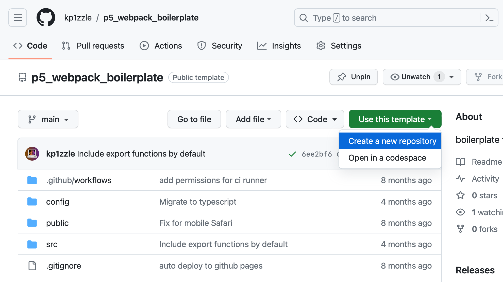
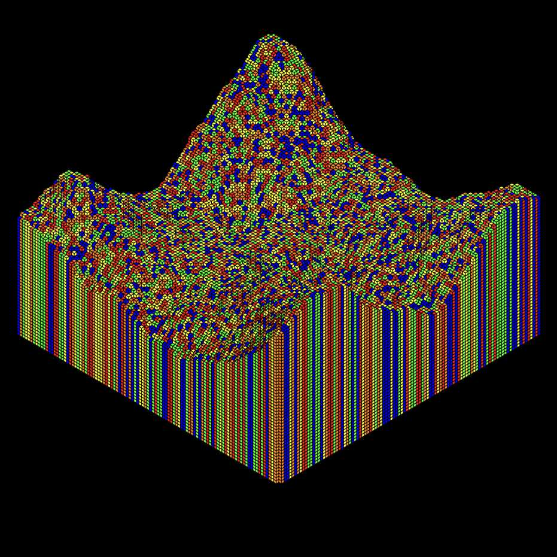

import {
    FlexContainer,
    HalfWidth,
    ThirdWidth,
    TwoThirdsWidth,
    TwentyPercentWidth,
    CustomWidth,
    Caption
} from '../../../components/post'
import Diagram from './diagram.svg'

#### Motivation
<FlexContainer>
    <ThirdWidth>
        P5.js is a popular Javascript library for creative coding. The creators of P5.js have also created an online editor, which provides an easy way for beginners to get started. However, the online editor has some disadvantages for the intermediate or advanced creative coder:

        - No local development, user must be connected to the internet to edit their sketches.
        - Code cannot be shared between sketches.
        - Node.js modules for additional functionality cannot be imported.
        - Presentation and distribution of completed sketches cannot be controlled.
    </ThirdWidth>
    <HalfWidth>
        `video: ./p5webeditor-min.mp4`
    </HalfWidth>
</FlexContainer>

#### Initial Approach
<FlexContainer>
    <ThirdWidth>
        My first approach was to create a [template repository](https://github.com/kp1zzle/p5_webpack_boilerplate) for a single sketch using [Node.js](https://nodejs.org/en) and [Webpack](https://webpack.js.org).

        I created a [GitHub actions](https://github.com/features/actions) configuration to automatically deploy to [GitHub pages](https://pages.github.com), a free hosting service, so the latest version of the sketch would always be live on the internet.

        While this workflow improved upon the online editor, it still had some shortcomings, since only one sketch was supported per repository. As a result, there could be no code reuse between sketches, and a new repository had to be created for every new sketch which was cumbersome and duplicative.
    </ThirdWidth>
    <HalfWidth>
        
    </HalfWidth>
</FlexContainer>

#### Building the Sketchbook
<FlexContainer>
    <ThirdWidth>
        I wanted to take the innovations from my first approach, but make a workflow that could automatically index sketches in a single directory in a single repo.
        To do accomplish this, I wrote custom webpack logic to minimize each sketch in a directory, and add HTML to an index page to point the the page for that sketch. Metadata is read from inside the sketch file to see the sketch description and date created. The file name is used as the sketch name.

    </ThirdWidth>
    <HalfWidth>
        `video: ./sketchbook-overview.mp4`
    </HalfWidth>
</FlexContainer>
<FlexContainer>
    <HalfWidth>
       <Diagram/>
    </HalfWidth>
</FlexContainer>

<FlexContainer>
    <ThirdWidth>
        Webpack bundle splitting is used, so JS is minimized libraries are cached and shared between sketches. For example, P5.js is only downloaded once, then opening subsequent sketches the only new downloads are a few bytes for the code of that sketch itself. This is a massive performance gain.

    </ThirdWidth>
    <HalfWidth>
        `video: ./cache-demo.mp4`
    </HalfWidth>
</FlexContainer>

#### My Sketchbook
<FlexContainer>
    <HalfWidth>
        <CustomWidth width={"75%"}>
        Using this workflow, my personal sketchbook has grown to contain 60+ unique sketches.

        It is live on the internet at [sketchbook.kieran.lol](https://sketchbook.kieran.lol).
        </CustomWidth>
    </HalfWidth>
    <HalfWidth>
        <CustomWidth width={"75%"}>
            `video: ./untitled_13.mp4`
            <Caption>[UNTITLED_13](https://sketchbook.kieran.lol/untitled_13.html) </Caption>
        </CustomWidth>
    </HalfWidth>
</FlexContainer>

<FlexContainer>
    <HalfWidth>
        <CustomWidth width={"75%"}>
        
            <Caption>[UNTITLED_16](https://sketchbook.kieran.lol/untitled_16.html) </Caption>
        </CustomWidth>
    </HalfWidth>
    <HalfWidth>
        <CustomWidth width={"75%"}>
        
            <Caption>[UNTITLED_21](https://sketchbook.kieran.lol/untitled_21.html) </Caption>
        </CustomWidth>
    </HalfWidth>
</FlexContainer>

<FlexContainer>
    <HalfWidth>
        <CustomWidth width={"75%"}>
            Code resuse enables me to iterate on similar ideas without overwriting existing code or unnecessarily duplicating.
            For example, I created a helper function to convert 3d coordinates into a 2d isometric projection and used it to create a series of isometric sketches.
        </CustomWidth>
    </HalfWidth>
    <HalfWidth>
        <CustomWidth width={"75%"}>
            
            <Caption>[ISOMETRIC_01](https://sketchbook.kieran.lol/isomtretic_01.html)</Caption>
        </CustomWidth>

    </HalfWidth>
</FlexContainer>
<FlexContainer>
    <HalfWidth>
    <CustomWidth width={"75%"}>
        
        <Caption>[ISOMETRIC_04](https://sketchbook.kieran.lol/isomtretic_04.html)</Caption>
    </CustomWidth>
    </HalfWidth>
    <HalfWidth>
    <CustomWidth width={"75%"}>
        
        <Caption>[ISOMETRIC_05](https://sketchbook.kieran.lol/isomtretic_05.html)</Caption>
    </CustomWidth>
    </HalfWidth>
</FlexContainer>

#### Sketchbook as a Platform
<FlexContainer>
    <ThirdWidth>
        Once I was happy with the workflow for myself, I wanted to make a generic version available for anyone to come and easily set up their own sketchbook.

        I forked my sketchbook repo, remove my sketches, wrote a README with instructions, and set it up as a github template. Now others can easily create their own sketchbook.

        This solves all of the issues with the basic online [P5js.org](http://P5js.org) editor, but it introduces a new one: no online editing. However, since the project is hosted on GitHub, artists can easily use the built in Codespaces online editor.
    </ThirdWidth>
    <HalfWidth>
        `video: ./sketchbook_codespace.mp4`
    </HalfWidth>
</FlexContainer>
