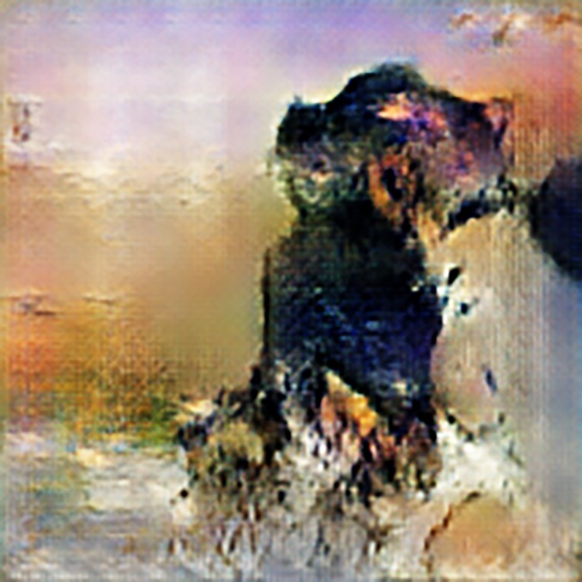

#### Introduction

<FlexContainer>
<ThirdWidth>
Given a large set of input-output pairs, a neural network can be trained to mimic the function f(x) that produced those pairs.
In 2019, X published a paper, showing how a neural network could be trained to mimic a mathematical function to produce artworks
that appear as if they came from the training dataset. While today AI image generation is widely known, in 2019 it was mostly limited to researchers.
</ThirdWidth>
<TwoThirdsWidth>
    
</TwoThirdsWidth>

</FlexContainer>

#### Research Questions
<FlexContainer>
<HalfWidth>
Influenced by my coursework in both Computer Science and the liberal arts, my research questions straddled Machine Learning, Human-Computer Interaction, and Philosophy. The research questions were:

- How can artist’s leverage Generative Adversarial Networks for their own art-making?
- Should we think of GANs as autonomous art-generating agents or as tools for artists?
</HalfWidth>
<HalfWidth>
Influenced by my coursework in both Computer Science and the liberal arts, my research questions straddled Machine Learning, Human-Computer Interaction, and Philosophy. The research questions were:

- How can artist’s leverage Generative Adversarial Networks for their own art-making?
- Should we think of GANs as autonomous art-generating agents or as tools for artists?
    Influenced by my coursework in both Computer Science and the liberal arts, my research questions straddled Machine Learning, Human-Computer Interaction, and Philosophy. The research questions were:

    - How can artist’s leverage Generative Adversarial Networks for their own art-making?
    - Should we think of GANs as autonomous art-generating agents or as tools for artists?
</HalfWidth>
</FlexContainer>
