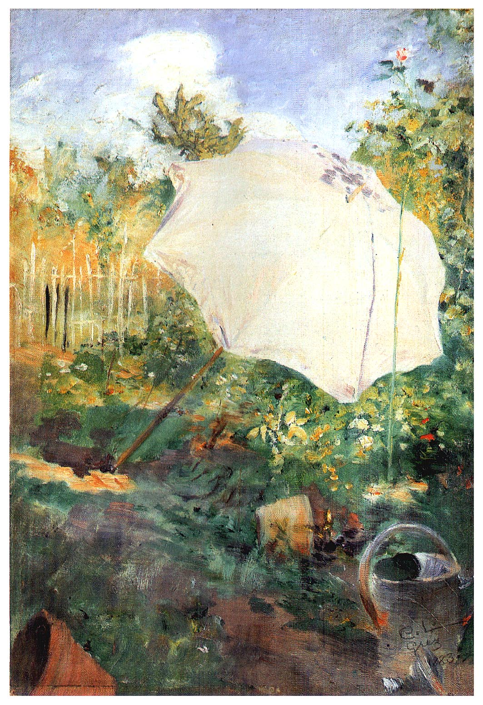
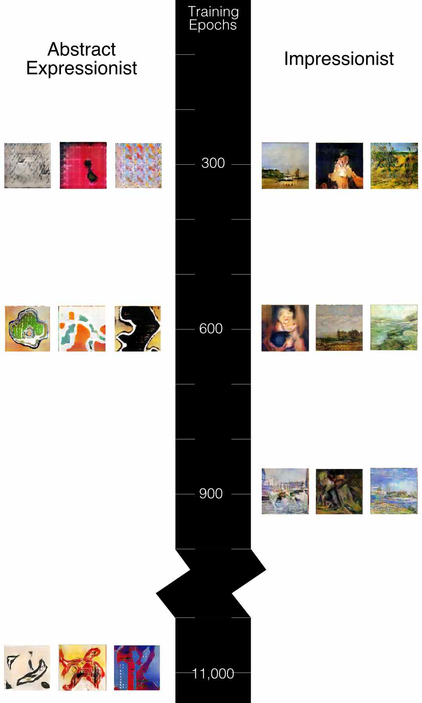

import {FlexContainer, HalfWidth, ThirdWidth, TwoThirdsWidth, TwentyPercentWidth, CustomWidth } from '../../../components/post'
import OutputSizeDiagram from './output-size-vert.svg'

#### Introduction

<FlexContainer>
<ThirdWidth>
Given a large set of input-output pairs, a neural network can be trained to mimic the function f(x) that produced those pairs.
In 2019, X published a paper, showing how a neural network could be trained to mimic a mathematical function to produce artworks
that appear as if they came from the training dataset. While today AI image generation is widely known, in 2019 it was mostly limited to researchers.
</ThirdWidth>
<HalfWidth>
    
</HalfWidth>
</FlexContainer>

#### Research Questions

<HalfWidth>
    Influenced by my coursework in both Computer Science and the liberal arts, my research questions straddled Machine Learning, Human-Computer Interaction, and Philosophy. The research questions were:

</HalfWidth>

<FlexContainer>
<ThirdWidth>

##### How can artist’s leverage Generative Adversarial Networks for their own art-making?

</ThirdWidth>
<ThirdWidth>
    ##### Should we think of GANs as autonomous art-generating agents or as tools for artists?
</ThirdWidth>
</FlexContainer>

#### Datasets
<FlexContainer>
    <HalfWidth>
        The simplest way to influence the output images is by curating the images in the dataset used to train the model.

        I conducted my experiments on two different datasets: Impressionist and Abstract Expressionist.  I created these datasets by downloading real artworks with specific style tags from WikiArt, a free online visual encyclopedia.
    </HalfWidth>
    <ThirdWidth>

    </ThirdWidth>
</FlexContainer>

##### Impressionist
<FlexContainer>
    <ThirdWidth>
        3,684 works of 19th century Impressionist painting, including:

    </ThirdWidth>
    <HalfWidth>
        <FlexContainer>
            <CustomWidth width={"35%"}>
                
            </CustomWidth>
            <CustomWidth width={"45%"}>
                
            </CustomWidth>
            <CustomWidth width={"45%"}>
                
            </CustomWidth>
            <CustomWidth width={"45%"}>
                
            </CustomWidth>
        </FlexContainer>
    </HalfWidth>

</FlexContainer>

##### Abstract Expressionist
<FlexContainer>
    <ThirdWidth>
        3,284 works of 20th century American abstract painting, including:

    </ThirdWidth>
    <HalfWidth>
    <FlexContainer>
    <CustomWidth width={"25%"}>
        
    </CustomWidth>
    <CustomWidth width={"35%"}>
        
    </CustomWidth>
    <CustomWidth width={"30%"}>
        
    </CustomWidth>
    </FlexContainer>
    </HalfWidth>
</FlexContainer>

#### Experiments

##### Output Canvas Size
<FlexContainer>
<ThirdWidth centerVertically={false}>
    Output canvas size is a parameter of the network architecture.
    It determines how large of an image the neural network will output.

    I observed that the image would become increasingly complex and phenomena within the image would become disjoint and seemingly haphazard as image size was increased.
</ThirdWidth>
<HalfWidth>
   <OutputSizeDiagram/>
</HalfWidth>
</FlexContainer>

##### Training Time
<FlexContainer>
    <ThirdWidth centerVertically={false}>
        Training time is a parameter of network training and refers to how long we train the network before generating images.
        A training epoch is one pass through all the images in the training dataset.
        In my experiments, I generated images after 300, 600, 900, and 12,000 epochs.
    </ThirdWidth>
    <HalfWidth>
        
    </HalfWidth>
</FlexContainer>

#### UI Prototype
dfsaf